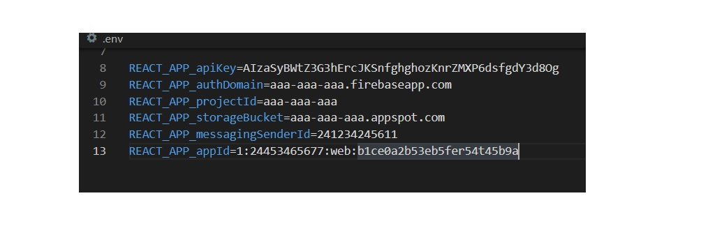

// Readme

# Nombre
E-Commerce realizado con React - Proyecto Final Lanatti

## Descripción
E-Commerce de productos simulado, con un array local, navegabilidad entre secciones de categorías y detalle de items. Cuenta con un contador de productos que trabaja con stock individual para cada producto y lleva a un cart para finalizar la compra un vez elegida la cantidad de productos.

### Visuales
</img>

#### Instalacion
El proyecto está armado en React, se necesita instalar NPM para utilizarlo. Se inicializa con el comando 'npm start'.

##### Firebase
El sitio trabaja con una base de datos en Firebase. Para poder utilizarlo, se deben generar credenciales en un archivo '.env' como en el siguiente ejemplo:
</img>

Dentro de Firebase se deberá crear una colección llamada 'productos' con un Doc por cada producto que incluya los campos category, descripcion, imgUrl, name, precio, stock.

Otra colección deberá ser creada para las categorías de los productos agregados que será comparada con el parámetro de categoría ingresado por el usuario. 

###### Rutas
Las rutas dentro del sitio son las siguientes:

'/' = catálogo de productos   
'/category/hombre' = productos de la categoría hombre   
'/category/mujer' = productos de la categoría mujer   
'/detail/:id' = detalle del producto seleccionado   
'/cart' = carrito de compras   
